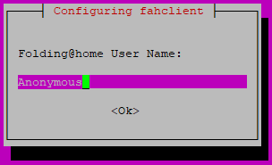
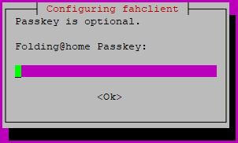
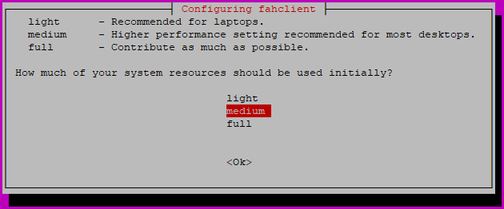
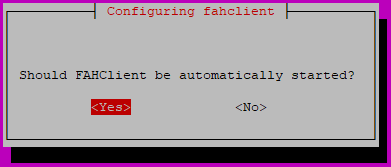

# Prerequisites

Download the latest Folding at Home client for Ubuntu listed [here](https://foldingathome.org/alternative-downloads/).

```wget https://download.foldingathome.org/releases/public/release/fahclient/debian-stable-64bit/v7.6/fahclient_7.6.9_amd64.deb```

# Installation

Install the FAHClient

```sudo dpkg -i --force-depends fahclient_7.6.9_amd64.deb```

Screenshot Username



Screenshot Team


Screenshot Passkey



Screenshot System Resources



Screenshot Start Automatically



# Remotely Access Web Client

Open the FAHClient config.xml file in the path below with the editor of your choice.

```/etc/fahclient/config.xml```

Add the following to the end of the configuration, replacing x.x.x.x with the IP address of the computer which should be granted remote access.

```
<!-- Grant Remote Access -->
<allow>127.0.0.1 x.x.x.x</allow>
<web-allow>127.0.0.1 x.x.x.x</web-allow>
```

! When editing the config.xml file for the first time, the file may be modified by the FAHClient before you can save your changes.  If this happens, close and reopen the config.xml file before adding and saving your changes.

# Remotely Access Web Client

Open a web browser and navigate to http://y.y.y.y:7396/ where y.y.y.y is the address of your Ubuntu Server.

Screenshot of Web Client

# Reviewing Log Files

Review the FAHClient log file to ensure there are no errors and you downloaded work files.

```sudo cat /var/lib/fahclient/log.txt```

Screenshot of Log File
