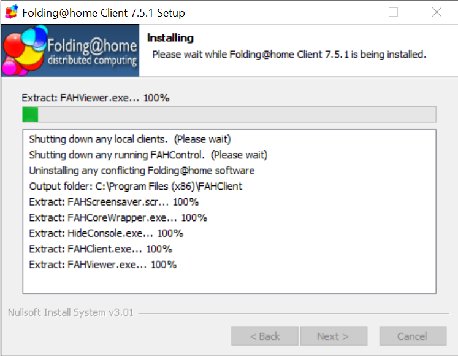
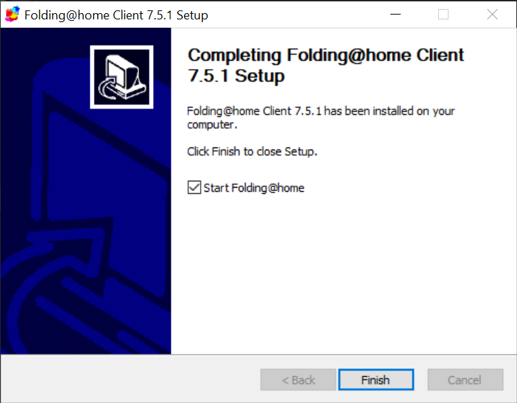
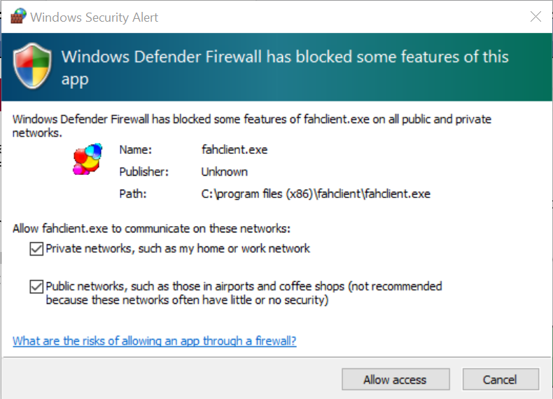
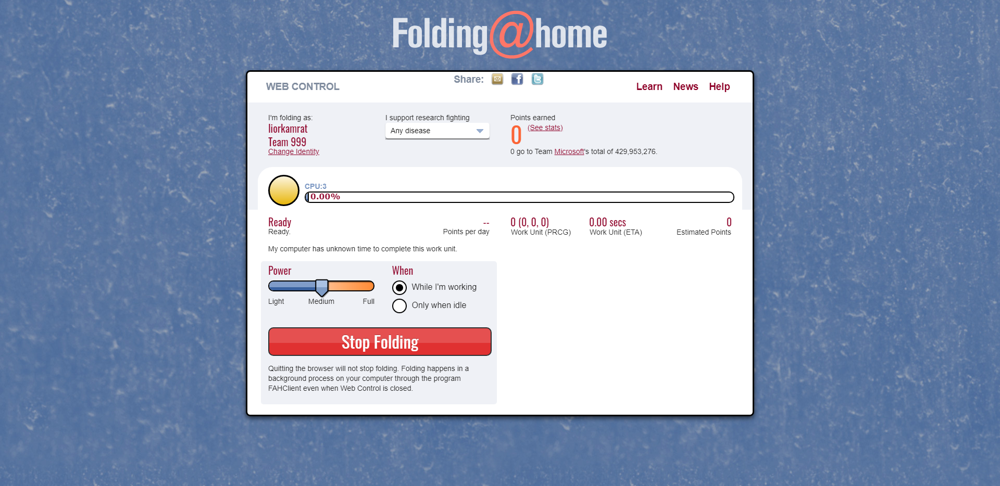
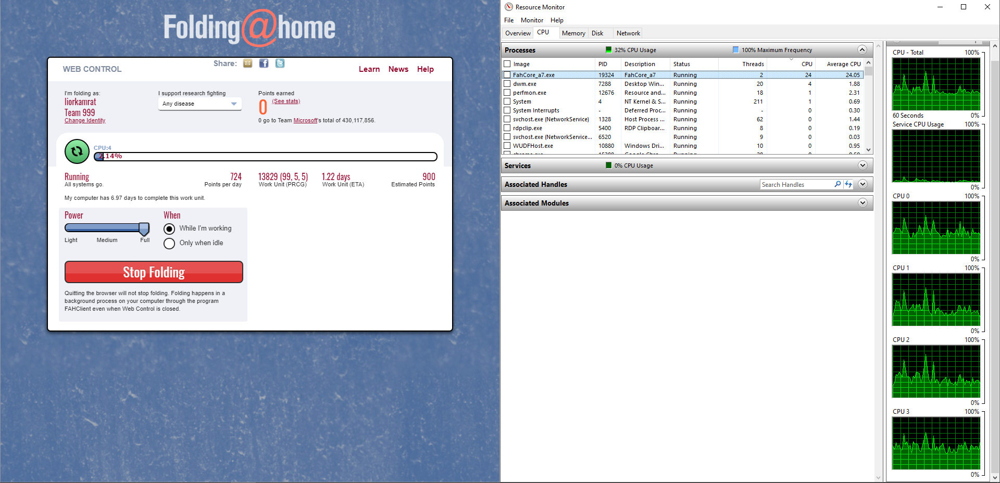

# Download & Windows Install

Honestly, this is very straight forward; you [download](https://foldingathome.org/start-folding/) the client from the website and install it with few clicks. Here are some screenshots. 

# Configure & Start folding

If you are getting a Windows Defender Firewall message, go ahead and allow the FAH client to communicate. 

Once you are done with the installation, a new web page will pop, asking you to either fold as "Anonymous" or set up an identity. We want to help by folding as part the Microsoft team so let's set up an identity and join the Microsoft group (#999)

Once you hit the "Save" button, your machine will start the folding process. 

**Note: it can take up to few minutes for the process to start so no worries one you see the bar showing 0%, this is OK.Short enough, you will start seeing the CPU bar % going up**

# How does that impact my machine?

Well, the short answer is that the FAH is a CPU-intensive workload so yeah, don't expect for this things to go easy on your system. 

You can move the level of "Power" the client is using to fold as well as configuring it to fold only when you are away and the machine is idle. 

In the screenshot below, you can how moving the Power level to "Full" hitting all 4 CPU cores on my machine.  

# I am done, what now?

Nothing really. The more you are folding the more you are contributing so keep at it as long as you want - it is really up to you. 